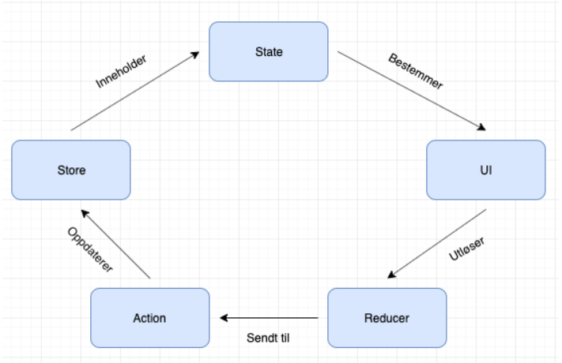
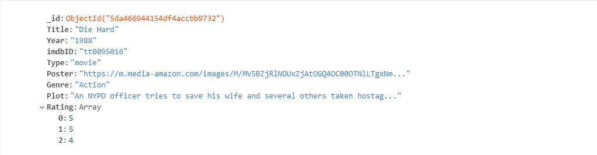
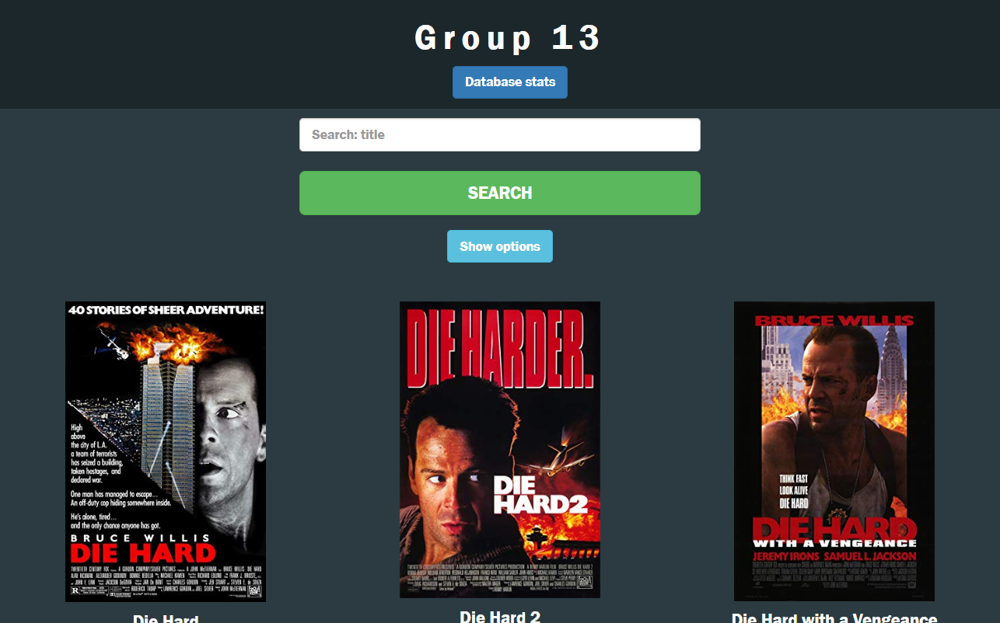
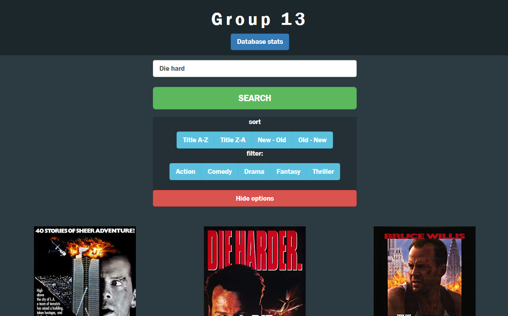
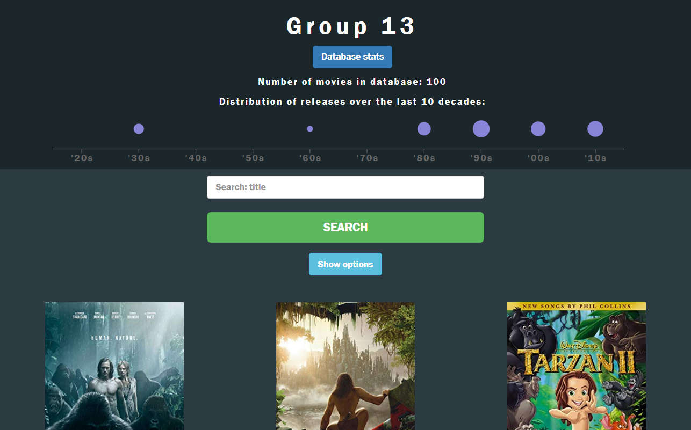
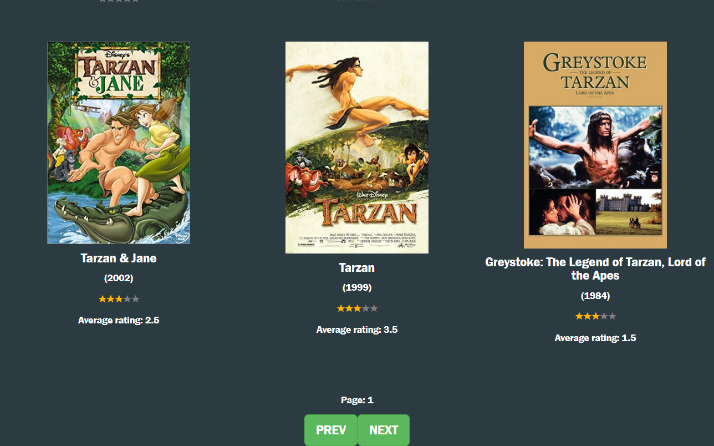

## Project-3 -  Gruppe 13

## Endring etter fristen
Vi gjorde en liten endring etter fristen som fikset litt bugs med utseende og serveren. Vi gjorde dette etter at vi fikk lov av læringsassistent Marius.

## Vår løsning
Vi har valgt å lage en web applikasjon hvor det er mulig å søke på ulike filmer, og få informasjon om disse. 
Det skal også være mulig å gi en rating på hver film. Brukeren vil etter å ha gitt sin rating, kunne se gjennomsnittlig rating for filmen. Brukeren har mulighet til å sortere filmer på år og tittel, og filtrere på sjangere.

## React-redux
Vi har valgt å bruke react Redux fremfor Mobux, da redux er bedre dokumentert, og dermed er lettere å sette seg inn i. 
Redux er et verktøy for å håndtere  states. Redux lagrer alle tilstandene globalt og i en store. 

Vi har alle reducerene våre i mappen reducers, som blir satt sammen i index.js med combineReducers også i mappen. 
I index.js i actions mappen blir alle funksjonene opprettet. I src/index.js oppretter vi en store ved createStore, 
i denne har vi lagt inn redux devtools extension som har vært et fantastisk verktøy og hjulpet oss masse. 
Vi har brukt mapStateToProps og mapDispatchToProps for å dispatche og hente ut tilstander til/fra store. 

## MongoDB
Databasen vi har valgt å bruke i dette prosjektet er mongoDB. MongoDB er et NoSQL-databaseprogram, og er godt dokumentert, 
som gjør det lett for oss som utviklere å bruke den.  Vi har opprettet en moviedb, som inneholder alle filmene, 
brukerne kan søke på. Oppsettet på hver film:

## REST Api
# Node.js, express & mongoose
Vi bruker express, som er et javascript rammeverk for node.js. Express “minimal & flexible” og gjør det lett og raskt å lage et robust API. 
Applikasjonen vår kjører på port 4000 og tillater requests fra alle. Ikke så bra sikkerhetsmessig, men var ikke et krav i oppgaven. 
Til MongoDB har vi brukt mongoose, som er et modeleringsverktøy designet for å jobbe i et asynkront miljø. 
Vi har blant annet brukt det til å lage ProduktSchema’et vårt: movies og til Paginate for sortering og sidevisning. 

# Pagination & sortering/filtrering
For sortering og sidevisning, har vi brukt en pagination plugin for mongoose: mongoose-paginate. Link til denne plugin’en finner du under kilder. Sortering og filtrering skjer via pagination på backendsiden, og som redux-state og url fetching på frontendsiden. 
Vi fetcher en url, med parametere som blir lagret i store med redux. Hvis vi endrer for eksempel type sortering, gjøres det et kall til databasen, og vi får en sortert json tilbake. Tilsvarende for filtrering. 

Vi har også valgt å ha sidevisning med enkle knapper som blar igjennom sidene. Disse blir også laget med pagination på samme måte som med sortering og filtrering. 

## Testing
Generelt gjennom utviklingen har vi fokusert på brukertesting, men har også involvert Jest og Cypress.

# Cypress

Vi benytter oss av cypress for automatisert end-to-end testing av prosjektet. Den går gjennom om noen av de mest sentrale funksjonene på side, og sørger for at vi får riktig respons.
For å kjøre testene navigerer du til frontend og kjører i to terminalinstanser:

`npm start`
`npm run test:cypress`

App.e2e.js er testfila.

# Jest
Vi benyttet Jest tester underveis i prosjektet for å enhetsteste prosjektet vårt. For å kjøre testene skriver man npm test i terminalen inne i frontend.
Mot slutten av prosjektet har vi brukt cypress tester. 
 

## CSS 

Vi har valgt å ha alle css filene i mappe sammen med komponenten den tilhører. Dette gjorde vi da vi følte det ble mer oversiktlig og forståelig. Vi har brukt reactstrap 3
til å få fine knapper, input felt osv. Vi har ikke reactstrap 4 da det krasjet hver gang vi prøvde å kjøre npm install på det, men hvis vi hadde hatt bedre tid er det blant tingene vi vil prøve å forbedre. 
Ellers i koden har vi brukt simple-react-modal, StarRatingComponent mm. Vi hadde lyst på et minimalistisk design, som var enkelt å forstå, og fint å se på, noe vi klarte ganske greit. 
Siden er også responsiv med både nettbrett og mobil. Det er fremdeles et par ting vi har lyst til å se mer på ang responsivitet, som feks at modalen ikke er responsiv. Siden dette ikke var et krav,
og vi rett og slett ikke har nok tid, valgte vi å heller ha det som "TODO" i fremtiden.

## Skjermdump av nettsiden
bilder:

Nettsiden vår slik den ser ut uten at vi trykker på noe
    

Etter å ha trykket på Show Options får man opp to buttongroups hvor man kan velge mellom sortering og filtrerings alternativer.
    

Når man trykker på Database stats får man opp statsene fra databasen. Her blir alle filmene sjekket, og vi viser i form av "bobler" hvor mange filmer som tilhører til ulike tiårene.
    
 
Enkel next, prev for å bla i de ulike sidene som kommer fra databasen. Her har vi også en plan om å oppgradere til å gi mer feedback ang hvilken side man er på og hvor mange det er totalt.
Vi kan også se hvordan rating systemt fungerer. Man kan trykke på antall stjerner man ønsker å rate en film med, og etter dette får man opp average rating. Vi valgte å la average rating komme opp etterpå, 
for å holde siden minimalistitsk og for å ikke påvirke brukeren av andre ratinger når han/hun velger å gi sin rating
  
## Kilder

*  [Youtube serie om REST Api (video 1-6):](https://www.youtube.com/watch?v=0oXYLzuucwE&list=PL55RiY5tL51q4D-B63KBnygU6opNPFk_q)
*  [Mongoose paginate:](https://www.npmjs.com/package/mongoose-paginate)
*  [Testet med omdbapi før vi hadde serveren oppe](http://www.omdbapi.com/)
*  [Guide til backend](https://www.robinwieruch.de/minimal-node-js-babel-setup?fbclid=IwAR3LhI0rajfUEFNTLRUmvGsZmTpbZE5WOY4_4QjLKist7L1hG2Nassdnrqo)
*  [Guide for end-to-end testing med cypress](https://www.robinwieruch.de/react-testing-cypress?fbclid=IwAR0mR3f2WNR2hH0IStmhCVbxEbwKm66QOU1NY6HZbbLkb2FNA_WqRBuzzIE)

